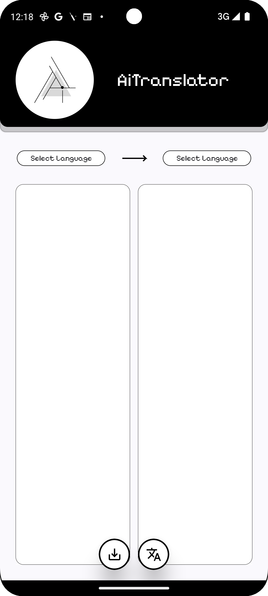
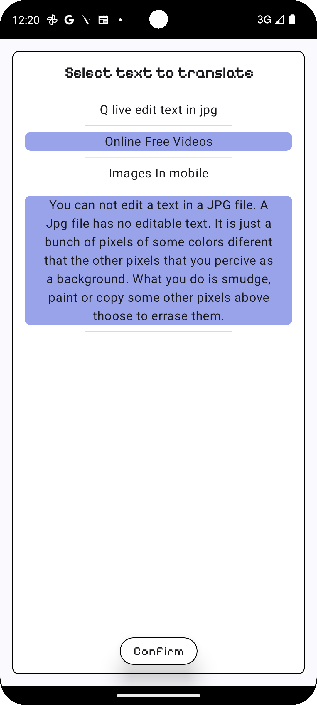
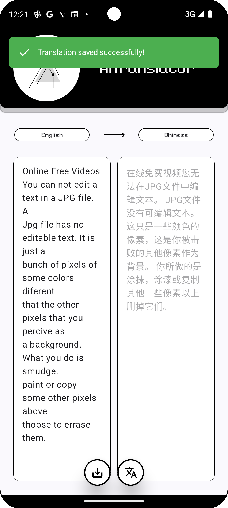
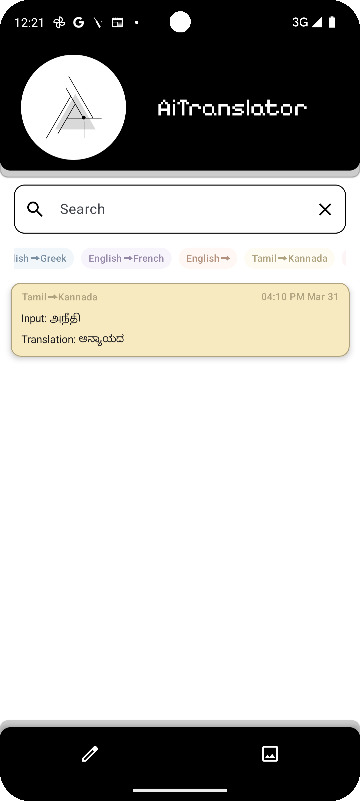
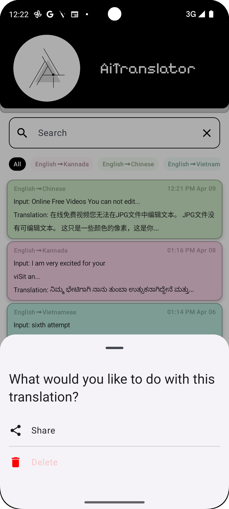
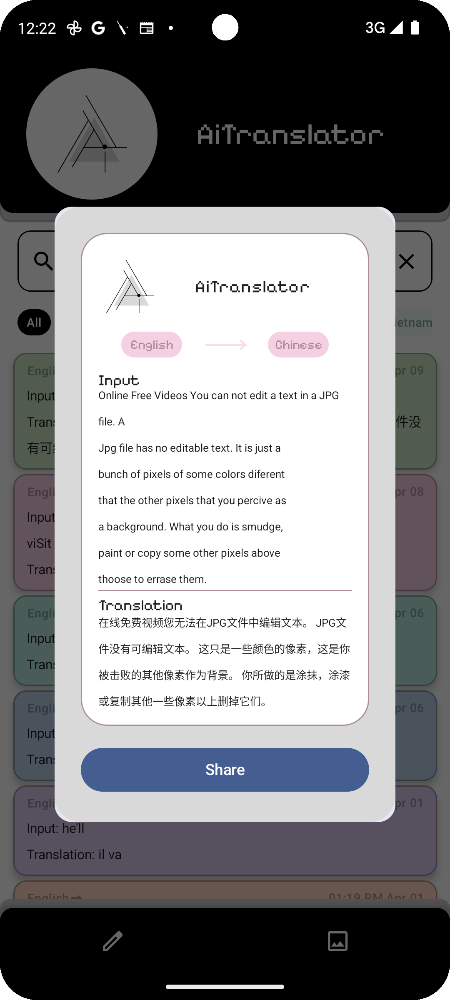

# AiTranslator

<div align="center">
  
</div>

## Overview

AiTranslator is a powerful, minimalist translation application built with Kotlin and Jetpack Compose that seamlessly combines the best features from Google Translate and Google Keep. It leverages Firebase ML Kit to provide accurate language detection, high-quality translation, and image-based text recognition, all in a clean, intuitive interface.

<p align="center">
  
  &nbsp;&nbsp;&nbsp;
  
  &nbsp;&nbsp;&nbsp;
  
  &nbsp;&nbsp;&nbsp;
  
  &nbsp;&nbsp;&nbsp;
  
  &nbsp;&nbsp;&nbsp;
  
  &nbsp;&nbsp;&nbsp;
  
  &nbsp;&nbsp;&nbsp;
  
  &nbsp;&nbsp;&nbsp;
  
</p>

## Features

### Core Functionality
- **Language Detection**: Automatically identify the source language
- **Text Translation**: Support for multiple language pairs
- **OCR Capabilities**: Extract text from images for immediate translation
- **Persistent Storage**: Save all translations for future reference using Room database

### User Experience
- **Minimalist Design**: Clean black and white interface with subtle pastel accents
- **Filtering System**: Find past translations by language pair or content
- **Language Tags**: Visual color-coded system for quick identification of language pairs
- **Offline Access**: View and manage past translations without internet connection
- **Shareable Cards**: Create and share beautifully formatted translation cards

## Technology Stack

- **UI Framework**: Jetpack Compose
- **Architecture**: MVVM with Clean Architecture principles
- **Database**: Room for local storage
- **ML Integration**: Firebase ML Kit
    - Translation API
    - Language Identification
    - Text Recognition
- **Dependency Injection**: Hilt
- **Concurrency**: Kotlin Coroutines & Flow
- **Image Processing**: Custom bitmap generation for shareable translations

## Screenshots

### Main Features
<p align="center">
  
  &nbsp;&nbsp;&nbsp;
  
  &nbsp;&nbsp;&nbsp;
  
  &nbsp;&nbsp;&nbsp;
  
</p>

### User Interface
<p align="center">
  
  &nbsp;&nbsp;&nbsp;
  
  &nbsp;&nbsp;&nbsp;
  
  &nbsp;&nbsp;&nbsp;
  
</p>

## Installation

1. Clone this repository
```bash
git clone https://github.com/Hakshay-Sundar/AiTranslator.git
```

2. Open the project in Android Studio

3. Create a Firebase project and add the google-services.json file to the app folder

4. Add Firebase ML Kit dependencies to your project

5. Build and run the project

## Architecture

AiTranslator follows a modern MVVM architecture with Clean Architecture principles:

The application is divided into:
- **Presentation Layer**: Jetpack Compose UI components, ViewModels
- **Domain Layer**: domain models
- **Data Layer**: Repository implementations, Room database, Firebase ML Kit integration

## Key Components

### 1. Translation Repository
Handles data operations between Room database and Firebase ML services:

```kotlin
class TranslationRepositoryImpl @Inject constructor(
    private val translationDao: TranslationDao,
    private val firebaseLanguageService: FirebaseLanguageService
) : TranslationRepository {
    // Implementation
}
```

### 2. View Models
Manage UI state and business logic:

```kotlin
@HiltViewModel
class TranslationViewModel @Inject constructor(
    private val translationRepository: TranslationRepository
) : ViewModel() {
    // Implementation with StateFlow and Coroutines
}
```

### 3. Composable UI
Declarative UI built with Jetpack Compose:

```kotlin
@Composable
fun TranslationScreen(
    viewModel: TranslationViewModel = hiltViewModel(),
    // Parameters
) {
    // Clean, composable-based UI implementation
}
```

## License

This project is licensed under the MIT License - see the [LICENSE](LICENSE) file for details.

## Acknowledgements

- Firebase ML Kit for providing powerful machine learning capabilities
- Google's Material Design guidelines and components
- The Kotlin and Jetpack Compose teams for the excellent development experience

---

<p align="center">
  Built with ❤️ by Hakshay Sundar
</p>